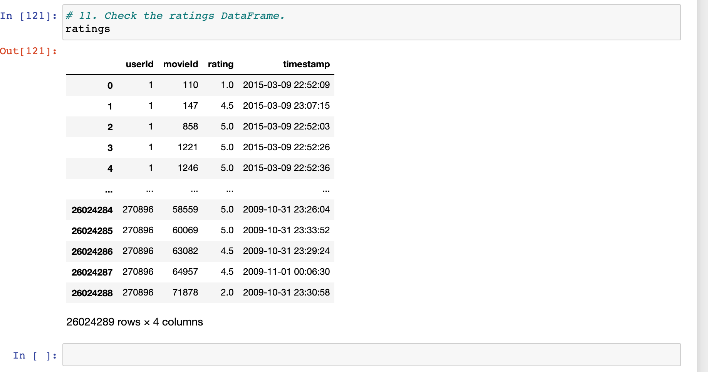
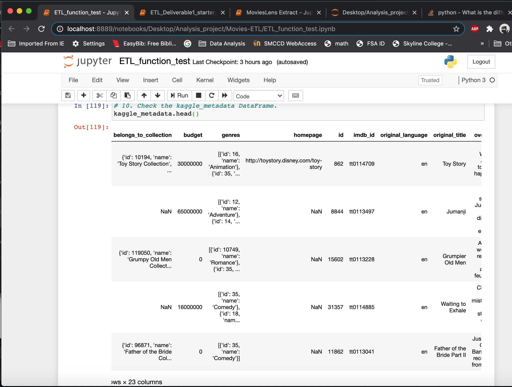
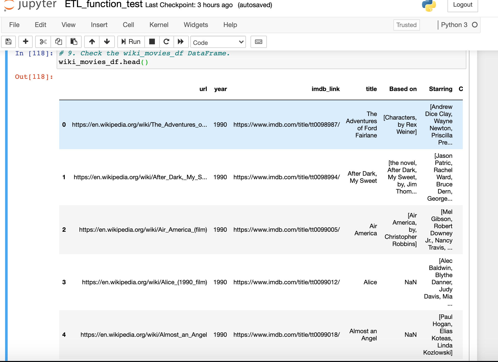

# Movies-ETL
## Module 8 of Berkley Bootcamp. Extract, Transform, and Load (ETL)

# Project overview.
### Amazing Prime loves the dataset and wants to keep it updated on a daily basis. Britta needs your help to create an automated pipeline that takes in new data, performs the appropriate transformations, and loads the data into existing tables. You’ll need to refactor the code from this module to create one function that takes in the three files—Wikipedia data, Kaggle metadata, and the MovieLens rating data—and performs the ETL process by adding the data to a PostgreSQL database.

### Deliverable 1: Write an ETL Function to Read Three Data Files
### Deliverable 2: Extract and Transform the Wikipedia Data
### Deliverable 3: Extract and Transform the Kaggle data
### Deliverable 4: Create the Movie Database

### To get this information [ETL_function_test.ipynb](ETL_function_test.ipynb)
## Challenge Summary

1. The data provided will always be in the correct file format like .json or .csv. If the data provided is not in that format the ETL pipeline will break.
2. The spelling of columns names will remain consistent. Columns will not be removed from the datasets.
3. The formatting of dollar amounts, dates, times, or other numbers will not change as this could break our regex expressions.
4. The sql database tables will not be dropped by anyone else and the data will always be deleted and replaced instead of appended to exisiting data.
5. Things like removing adult movies, not including TV shows, and removing rows based on conditions are all built into the function specifically so they can't change their mind later without refactoring the function.
